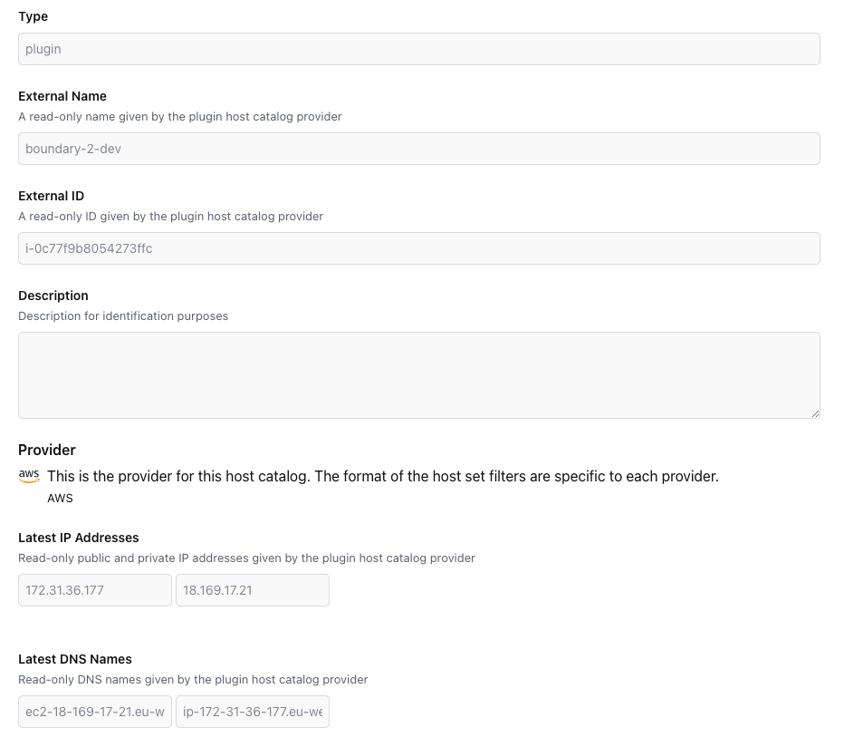

# Dynamic Host Catalog Example

Using this tutorial (https://developer.hashicorp.com/boundary/tutorials/host-management/aws-host-catalogs) - we are terraforming its content.

There are some additions to what is contained in that tutorial:

1. We are using the private key created in step two.
2. That private key is stored within Boundary (Credential Brokering)
3. Host Set plugins are configured with Preferred endpoint so the connection goes to the public IP (FQDN in this case) of the hosts, otherwise the private IP will be used. This can be overcome by using a self-managed worker.

   ```bash
   resource "boundary_host_set_plugin" "dev" {
     name            = "Dev host_set_plugin"
     host_catalog_id = boundary_host_catalog_plugin.aws_example.id
     attributes_json = jsonencode({ "filters" = ["tag:application=dev"] })
     preferred_endpoints = ["dns:ec2*"]
   }
   ```



The result of this would be a new organization called "demo_organization" that contains three targets. 


The targets will contain a number of Hosts based on the tagging used


Given a target contain multiple host if we connect via the target we will connect to a host randomly

```bash
> boundary connect ssh -target-id ttcp_5nD9VPPVgX

The authenticity of host 'hplg_olf59u7hie ([127.0.0.1]:56140)' can't be established.
ED25519 key fingerprint is SHA256:qH6UE9FuGNfM+alVs11Ypmk+0PlYCmtANQuMAw6TPFM.
This key is not known by any other names
Are you sure you want to continue connecting (yes/no/[fingerprint])? yes
Warning: Permanently added 'hplg_olf59u7hie' (ED25519) to the list of known hosts.
Welcome to Ubuntu 20.04.6 LTS (GNU/Linux 5.15.0-1039-aws x86_64)

 * Documentation:  https://help.ubuntu.com
 * Management:     https://landscape.canonical.com
 * Support:        https://ubuntu.com/advantage

  System information as of Thu Jul 20 15:58:44 UTC 2023

  System load:  0.0               Processes:             101
  Usage of /:   20.9% of 7.57GB   Users logged in:       0
  Memory usage: 22%               IPv4 address for ens5: 172.31.43.192
  Swap usage:   0%


Expanded Security Maintenance for Applications is not enabled.

0 updates can be applied immediately.

Enable ESM Apps to receive additional future security updates.
See https://ubuntu.com/esm or run: sudo pro status


The programs included with the Ubuntu system are free software;
the exact distribution terms for each program are described in the
individual files in /usr/share/doc/*/copyright.

Ubuntu comes with ABSOLUTELY NO WARRANTY, to the extent permitted by
applicable law.

To run a command as administrator (user "root"), use "sudo <command>".
See "man sudo_root" for details.

ubuntu@ip-172-31-43-192:~$ exit
```

However we can include the host-id to specify a host in particular

```bash
> boundary connect ssh -target-id ttcp_5nD9VPPVgX -host-id hplg_OlF59u7hIe
Welcome to Ubuntu 20.04.6 LTS (GNU/Linux 5.15.0-1039-aws x86_64)

 * Documentation:  https://help.ubuntu.com
 * Management:     https://landscape.canonical.com
 * Support:        https://ubuntu.com/advantage

  System information as of Thu Jul 20 16:00:20 UTC 2023

  System load:  0.0               Processes:             103
  Usage of /:   21.3% of 7.57GB   Users logged in:       0
  Memory usage: 23%               IPv4 address for ens5: 172.31.43.192
  Swap usage:   0%


Expanded Security Maintenance for Applications is not enabled.

0 updates can be applied immediately.

Enable ESM Apps to receive additional future security updates.
See https://ubuntu.com/esm or run: sudo pro status

Failed to connect to https://changelogs.ubuntu.com/meta-release-lts. Check your Internet connection or proxy settings


Last login: Thu Jul 20 15:58:45 2023 from 34.232.124.174
To run a command as administrator (user "root"), use "sudo <command>".
See "man sudo_root" for details.

ubuntu@ip-172-31-43-192:~$ 
```

## Clean Up

Simply

```bash
terraform destroy -auto-approve
```
